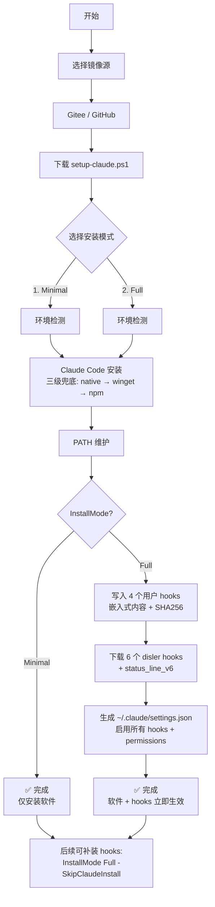

<div align="center">

# Claude Code Bootstrap

**一键拉起 Claude Code 工作环境（Windows PowerShell）**

[](https://github.com/ErgeAIA/claude-code-bootstrap)
[](https://gitee.com/ErgeAIA/claude-code-bootstrap)
[](LICENSE)
[](https://github.com/ErgeAIA/claude-code-bootstrap)

[快速开始](#-快速开始) · [功能特性](#-功能特性) · [作者信息](#-作者信息) · [更新日志](CHANGELOG.md)

</div>

---

## 这是什么

在 Windows 上一行命令安装 Claude Code，**可选部署 hooks 工作流，免去手动配环境、写 settings.json、拉脚本的繁琐**。

适合以下场景：

- 🆕 刚拿到新电脑，想 5 分钟内用上 Claude Code
- 🔄 旧机器重装系统，需要快速恢复工作流
- 👥 团队内部统一开发环境
- 🇨🇳 国内网络环境，规避 GCS 直连超时、GitHub raw 卡顿

## 🚀 快速开始

**以管理员身份打开 PowerShell**，执行：

```powershell
iwr https://raw.githubusercontent.com/ErgeAIA/claude-code-bootstrap/main/install.ps1 | iex
```

国内网络推荐（自动测速，优先 Gitee）：

```powershell
iwr https://gitee.com/ErgeAIA/claude-code-bootstrap/raw/main/install.ps1 | iex
```

脚本会自动：
1. 测速选择最快镜像源
2. 下载主脚本 `setup-claude.ps1`
3. **选择安装模式**（默认仅安装软件，可选完整安装含 hooks）
4. 检测 PowerShell、Git、UV、Node.js（缺啥补啥）
5. 三级兜底安装 Claude Code（native → winget → npm）
6. 自动配置 PATH（立即生效）
7. 完整模式下：
   - 写入 4 个用户自写 hooks（来自仓库嵌入内容）
   - 下载 6 个 disler 仓库 hooks + status_line_v6
   - **自动生成 `~/.claude/settings.json` 启用所有 hooks**
8. 验证安装结果

**全程约 2-5 分钟**，取决于网络。

## 执行流程



## ✨ 功能特性

| 类别                 | 说明                                       |
| -------------------- | ------------------------------------------ |
| 🛡️ **三级兜底安装**   | native (GCS) → winget → npm，任一成功即停  |
| ⏱️ **超时自动切换**   | native 60 秒无响应自动降级，避免卡死       |
| 🔐 **SHA256 校验**    | 二进制 + hooks 双重校验，防供应链攻击      |
| 🔄 **幂等运行**       | 已装组件自动跳过，可重复执行               |
| 🪞 **智能镜像选源**   | Gitee / GitHub 自动测速，优先最快          |
| 🔁 **下载重试**       | 网络抖动自动重试 3 次                      |
| 🛣️ **PATH 自动维护**  | native / winget / npm 三种位置都处理       |
| 🪝 **hooks 可选部署** | 交互选择是否安装，默认不部署，尊重安全考量 |
| 📋 **依赖自检**       | PowerShell、Git、UV、Node.js 缺啥补啥      |
| 🔒 **hooks 安全校验** | SHA256 校验防篡改，校验失败自动删除        |
| 🌐 **hooks 双源下载** | Gitee + GitHub 双源，国内优先 Gitee        |

## 📦 包含内容

部署完成后，`~/.claude/` 目录结构如下（完整安装模式）：

```
~/.claude/
├── hooks/
│   ├── auto_format.py             # [ErgeAIA] 写文件后自动格式化
│   ├── block_dangerous.py         # [ErgeAIA] 拦截危险 Bash 命令
│   ├── check_secrets.py           # [ErgeAIA] 检测密钥泄露
│   ├── verify_on_stop.py          # [ErgeAIA] 完成前验证项目
│   ├── pre_tool_use.py            # [disler] 工具调用前安全检查
│   ├── post_tool_use.py           # [disler] 工具调用后日志记录
│   ├── session_start.py           # [disler] 会话开始加载上下文
│   ├── user_prompt_submit.py      # [disler] 用户输入日志
│   ├── post_tool_use_failure.py   # [disler] 工具失败日志
│   └── session_end.py             # [disler] 会话结束清理
├── status_lines/
│   └── status_line_v6.py          # [disler] 上下文窗口使用率监控
├── settings.json                  # 自动生成，启用所有 hooks + 权限配置
├── backups/                       # settings.json 写入前自动备份（保留最近 10 个）
│   └── settings.json.20260603-120000.bak
└── logs/                          # hooks 自动生成的 JSON 日志
```

> 仅安装模式（默认）不会创建上述目录，仅安装 Claude Code 本体。
>
> `[ErgeAIA]` hooks 来自本仓库 `hooks/` 目录，**安装时由 setup-claude.ps1 嵌入内容自动写入**。
> `[disler]` hooks 来自 disler/claude-code-hooks-mastery 仓库，安装时联网下载 + SHA256 校验。

## ⚙️ 高级用法

### 安装模式

脚本提供两种安装模式，运行时交互选择（默认选项 1）：

| 选项  | 模式                       | 说明                                             |
| ----- | -------------------------- | ------------------------------------------------ |
| **1** | 仅安装 Claude Code（默认） | 安装本体 + PATH 配置，不下载 hooks               |
| **2** | 完整安装                   | 安装本体 + 从第三方仓库下载 hooks 和 status_line |

也可以通过参数直接指定，跳过交互：

```powershell
# 仅安装软件（默认）
.\setup-claude.ps1 -InstallMode Minimal

# 完整安装（软件 + hooks）
.\setup-claude.ps1 -InstallMode Full

# 后续补装 hooks（跳过已安装的 Claude Code）
.\setup-claude.ps1 -InstallMode Full -SkipClaudeInstall
```

### 指定安装版本

```powershell
# 安装最新稳定版（默认）
.\setup-claude.ps1

# 安装具体版本
.\setup-claude.ps1 -ClaudeVersion 2.1.153

# 仅部署 hooks（跳过 Claude Code 安装）
.\setup-claude.ps1 -SkipClaudeInstall

# 自定义 native 安装超时时间
.\setup-claude.ps1 -InstallTimeout 120
```

### 与 cc-switch 配合

本项目**会**在 Full 模式下自动生成 `~/.claude/settings.json`（写入前自动备份到 `~/.claude/backups/`）。如果你同时使用 [cc-switch](https://github.com/farion1231/cc-switch) 管理供应商切换：

- cc-switch 切换供应商时会**整体覆盖** settings.json（它自己也会备份）
- 我们的脚本写入后，cc-switch 下次切换会重建配置，hooks 不会丢失（通用配置片段存在 cc-switch 数据库中）
- **建议顺序**：先跑本脚本部署 hooks → 再用 cc-switch 切换供应商

### 已有配置保护

脚本在 Full 模式写入前会自动执行：

1. **检测报告**：`Test-ExistingConfig` 扫描 `~/.claude/settings.json`、`~/.claude.json`、hooks、status_lines 是否已存在
2. **自动备份**：`Backup-SettingsJson` 把 `~/.claude/settings.json` → `~/.claude/backups/settings.json.<timestamp>.bak`（保留最近 10 个）
3. **交互选择策略**：`Read-SettingsJsonStrategy` 检测到 settings.json 已存在时提供 4 种策略：
   - **1. 覆盖** — 整体替换（备份已完成，最简单但丢失用户 env/MCP 等）
   - **2. 合并**（推荐） — 保留用户 env/permissions，添加 hooks/statusLine，深度合并语义见下
   - **3. 跳过** — 仅部署 hooks 文件，不动 settings.json
   - **4. 取消** — 保留所有现有配置，退出安装

#### 深度合并语义（策略 2）

`Install-SettingsJson -Strategy merge` 调用 `Merge-Hooks` 和 `Merge-Permissions` 实现字段级合并：

| 字段 | 策略 | 说明 |
|------|------|------|
| `env` | 用户优先 | 保护 API key / base URL，缺失 key 用项目补 |
| `enabledPlugins` | 双方合并 | 用户开关优先（用户可能关掉某个插件） |
| `hooks` | 按事件追加去重 | 用户 hooks 保留 + 项目 hooks 追加（按 command 去重） |
| `permissions.allow` | 并集去重 | 最宽松，双方都允许才保留 |
| `permissions.deny` | 并集去重 | 最严格，任一方禁止就禁止 |
| `permissions.defaultMode` | 用户优先 | 用户可能选了更保守的 `ask` |
| `permissions.skipDangerousModePermissionPrompt` | 用户优先 | 同上 |
| `statusLine` | 项目优先 | 统一 status_line_v6 |
| `autoConnectIde` | 项目优先 | |
| 其他字段（`ccmManaged` / `ccmProvider` 等） | 用户优先保留 | |

写入采用原子写（`.tmp` + `Move-Item` + UTF-8 无 BOM），崩溃不会留半截文件。

> 💡 如果你是从零部署（无既有配置），脚本会直接创建，无需任何选择。

### Onboarding 跳过（Full 模式默认行为）

`Full` 模式会自动在 `~/.claude.json` 中写入 `hasCompletedOnboarding: true`，**首次启动不再弹主题选择/欢迎向导**。该标记：

- **零安全风险**：仅跳过欢迎页，不影响权限/信任/MCP 等关键决策
- **幂等**：全局标记，写一次永久生效
- **可手动关闭**：编辑 `~/.claude.json` 删除该字段，或：
  ```powershell
  # 重新跑一次，会重写
  .\setup-claude.ps1 -InstallMode Full -SkipClaudeInstall
  ```

> ⚠️ `hasTrustDialogAccepted`（工作区信任大门）和 `hasCompletedProjectOnboarding`（项目级 onboarding）**不会**被脚本预填。前者涉及 CVE-2026-33068 类风险，后者需要绝对路径且反幂等。如有需要可手动编辑 `~/.claude.json`。

## 🔧 三种安装方式对比

| 方式             | 文件位置                               | 是否自动配 PATH | 何时使用                     |
| ---------------- | -------------------------------------- | --------------- | ---------------------------- |
| **native (GCS)** | `~/.local/bin/claude.exe`              | ✅ 我们处理      | **默认首选**（官方推荐）     |
| **winget**       | `%LocalAppData%\Programs\claude-code\` | ✅ 通常自动      | native 超时/被墙时           |
| **npm**          | `%AppData%\Roaming\npm\claude.cmd`     | ✅ 通常自动      | 上面都失败时（官方已不推荐） |

## 📋 系统要求

- Windows 10 1809+ / Windows 11
- PowerShell 5.1+（Win10 自带 5.1，Win11 自带 7.x）
- 64 位系统
- 网络可访问 GitHub / Gitee（至少一个）

可选依赖（脚本会自动检测，缺失会警告或自动安装）：

- **Git**：hooks 中部分脚本需要
- **UV**：hooks 全部用 `uv run --script` 执行
- **Node.js**：仅 npm 兜底安装时需要

## 🗂️ 项目结构

```
claude-code-bootstrap/
├── install.ps1              # 入口脚本（智能选源 + 自动重试）
├── setup-claude.ps1         # 主体脚本（环境检测 + 安装 + 部署 hooks + 生成 settings.json + 配置保护）
├── GeneralConfiguration.json # cc-switch 通用配置模板（参考用，脚本已内嵌）
├── checksums.txt            # hooks 和 status_line 的 SHA256 哈希值
├── scripts/
│   └── update-checksums.ps1 # 刷新 hooks SHA256 哈希值（支持 -DryRun 预览）
├── hooks/                   # 用户自写 hooks 源（4 个，提交到仓库 + 嵌入到 setup-claude.ps1）
│   ├── auto_format.py       # 写文件后自动格式化
│   ├── block_dangerous.py   # 拦截危险 Bash 命令
│   ├── check_secrets.py     # 检测密钥泄露
│   └── verify_on_stop.py    # 完成前验证项目
├── .github/
│   └── workflows/
│       └── update-checksums.yml # 每周自动检测上游 hooks 变更并创建 PR
├── README.md                # 本文件（中文文档）
├── CHANGELOG.md             # 中文更新日志
├── CHANGELOG.en.md          # English changelog
├── CLAUDE.md                # AI 工作指南
├── LICENSE                  # AGPL-3.0 协议
└── logs/                    # hooks 运行时生成的 JSON 日志（gitignore）
```

> **注意**：仓库的 `hooks/*.py` 既是开发源文件，也是 `setup-claude.ps1` 嵌入内容的源。
> 修改这些 hooks 后，需重新嵌入到 `setup-claude.ps1` 并更新 `$CHECKSUMS` 中的哈希。

## 📖 GeneralConfiguration.json 字段说明

本项目的 `GeneralConfiguration.json` 是给 **cc-switch 通用配置片段** 用的完整模板，复制粘贴到 cc-switch 的"通用配置"里即可启用 hooks、权限、状态行等。

### 顶层字段

| 字段             | 类型    | 说明                                               |
| ---------------- | ------- | -------------------------------------------------- |
| `$schema`        | string  | JSON Schema 路径，仅 IDE 智能提示用，不影响功能    |
| `enabledPlugins` | object  | 启用的官方插件，key 是插件 ID，value 是开关        |
| `env`            | object  | 注入到 Claude Code 进程的环境变量                  |
| `autoConnectIde` | boolean | 启动时自动检测并连接 IDE（VS Code / JetBrains 等） |
| `statusLine`     | object  | 自定义状态行配置，显示在终端底部                   |
| `hooks`          | object  | 生命周期钩子，按事件触发外部命令                   |
| `permissions`    | object  | 工具调用权限控制（白名单/黑名单/默认模式）         |

### enabledPlugins — 启用的插件

| 插件 ID                               | 作用                                                                      |
| ------------------------------------- | ------------------------------------------------------------------------- |
| `feature-dev@claude-plugins-official` | 启用 `/feature-dev` 命令，引导 Claude 按需求-设计-实现-测试的流程开发功能 |

### env — 环境变量

| 变量                                       | 值    | 作用                                                 |
| ------------------------------------------ | ----- | ---------------------------------------------------- |
| `DISABLE_AUTO_COMPACT`                     | `"1"` | 关闭自动压缩（auto-compact），保留完整上下文不被截断 |
| `CLAUDE_CODE_DISABLE_NONESSENTIAL_TRAFFIC` | `"1"` | 关闭遥测、错误上报等非必要网络流量                   |

### statusLine — 状态行

| 字段      | 值                                                         | 作用                                                          |
| --------- | ---------------------------------------------------------- | ------------------------------------------------------------- |
| `type`    | `"command"`                                                | 类型为执行 shell 命令                                         |
| `command` | `uv run --script ~/.claude/status_lines/status_line_v6.py` | 用 uv 零依赖执行 status_line 脚本，显示上下文窗口使用率进度条 |

### hooks — 生命周期钩子

| 事件                                     | 触发时机        | 配置的命令                                                                             |
| ---------------------------------------- | --------------- | -------------------------------------------------------------------------------------- |
| `SessionStart`                           | 会话开始时      | `session_start.py --load-context`（加载项目上下文）                                    |
| `UserPromptSubmit`                       | 用户发送消息后  | `user_prompt_submit.py --log-only`（记录输入日志）                                     |
| `PreToolUse` (Bash)                      | Bash 命令执行前 | `block_dangerous.py`（拦截危险命令）+ `pre_tool_use.py`                                |
| `PreToolUse` (Read/Edit/MultiEdit/Write) | 文件读写前      | `pre_tool_use.py`                                                                      |
| `PostToolUse` (Write/Edit/MultiEdit)     | 文件写入后      | `auto_format.py`（自动格式化）+ `check_secrets.py`（检查密钥泄露）+ `post_tool_use.py` |
| `PostToolUseFailure`                     | 工具执行失败    | `post_tool_use_failure.py`（失败日志）                                                 |
| `Stop`                                   | 会话停止时      | `verify_on_stop.py`（运行测试/构建验证）                                               |
| `SessionEnd`                             | 会话结束时      | `session_end.py`（清理临时文件）                                                       |

每个 hook 都可以设置独立的 `timeout`（秒），范围 10-120 秒。

### permissions — 权限控制

| 字段                                | 说明                                              |
| ----------------------------------- | ------------------------------------------------- |
| `allow`                             | 白名单列表，匹配前缀的命令无需确认即可执行        |
| `deny`                              | 黑名单列表，匹配前缀的命令直接拒绝                |
| `defaultMode`                       | 默认模式：`bypassPermissions`（跳过所有权限确认） |
| `skipDangerousModePermissionPrompt` | 跳过危险模式下的二次确认弹窗                      |

#### 允许执行的命令白名单

| 类别           | 命令                                                   |
| -------------- | ------------------------------------------------------ |
| Rust 工具链    | `cargo check/build/test/fmt/tauri*`                    |
| Node.js 工具链 | `npm run*`、`pnpm*`、`bun*`                            |
| Python 工具链  | `uv run*`、`uv pip*`、`ruff*`                          |
| 搜索工具       | `rg*`、`fd*`                                           |
| Git 操作       | `status/diff/log/add/commit/push/pull/checkout/branch` |

#### 拒绝执行的黑名单

| 规则                  | 作用                                         |
| --------------------- | -------------------------------------------- |
| `Read(./.env)`        | 禁止读取项目根 .env                          |
| `Read(./.env.*)`      | 禁止读取所有 .env.* 文件                     |
| `Read(./secrets/**)`  | 禁止读取 secrets 目录                        |
| `Read(**/id_rsa)`     | 禁止读取 SSH RSA 私钥                        |
| `Read(**/id_ed25519)` | 禁止读取 SSH Ed25519 私钥                    |
| `Bash(curl http://*)` | 禁止用 curl 访问 HTTP 明文站点（强制 HTTPS） |

### 使用方法

Full 模式安装时**已自动完成**：

1. ✅ 4 个用户 hooks（仓库 `hooks/`）→ 写入 `~/.claude/hooks/`
2. ✅ 6 个 disler hooks + status_line → 写入 `~/.claude/hooks/` 和 `~/.claude/status_lines/`
3. ✅ 合并本配置到 `~/.claude/settings.json`，立即启用 hooks + 权限

**可选**：如果想在 cc-switch 里进一步自定义，可将本 `GeneralConfiguration.json` 粘贴到 cc-switch 的"通用配置片段"中（合并已写入的 settings.json 不会冲突，因为 hooks 是追加的）。

**验证**：
```powershell
# 查看部署的 settings.json
cat ~/.claude/settings.json | ConvertFrom-Json

# 确认 hooks 数量
(Get-ChildItem ~/.claude/hooks/*.py).Count   # 应该是 10

# 启动 Claude Code
claude
```

## 🤝 贡献

欢迎提交 Issue 和 Pull Request！

如果你的环境遇到问题，请提供：
- Windows 版本（`winver`）
- PowerShell 版本（`$PSVersionTable.PSVersion`）
- 网络环境（是否能访问 GitHub / Gitee）
- 完整错误输出

## 👤 作者信息

<table>
<tr>
<td align="center" width="200">
<br>
<b>宝藏二哥AIA / ErgeAIA</b><br>
<sub>生命不息，折腾不止</sub>
</td>
<td>

**关于我**：独立开发者 / 全栈工程师 / 产品经理 / Vibe Coding 实践者

**技术栈**：Tauri · Rust · React · Python · Claude · Cursor · Trae

**理念**：三无分享 — 无门槛、无套路、无保留

**链接**：
- 📺 [B 站](https://space.bilibili.com/67221461) · 知乎 · 微信
- 🐙 [GitHub](https://github.com/ErgeAIA) · [Gitee](https://gitee.com/ErgeAIA)
- 📦 精选项目：[ErgeAIA-skills](https://github.com/ErgeAIA/ErgeAIA-skills) · [ErgeMD](https://github.com/ErgeAIA/ErgeMD) · [catapult-cn](https://github.com/ErgeAIA/catapult-cn)

</td>
</tr>
</table>

---

<div align="center">

如果这个项目帮到了你，欢迎点个 ⭐ 鼓励一下！

<sub>用 ❤️ 和 PowerShell 制作</sub>

</div>
